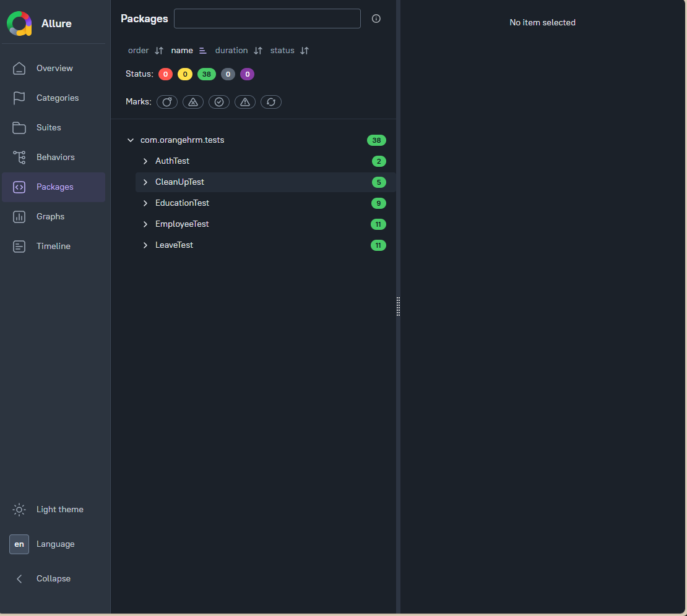
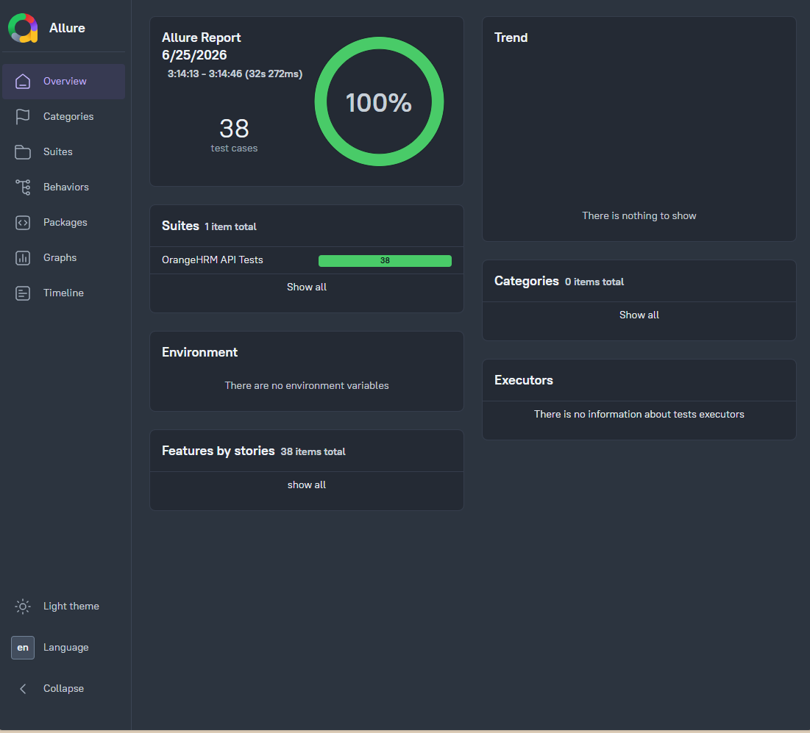
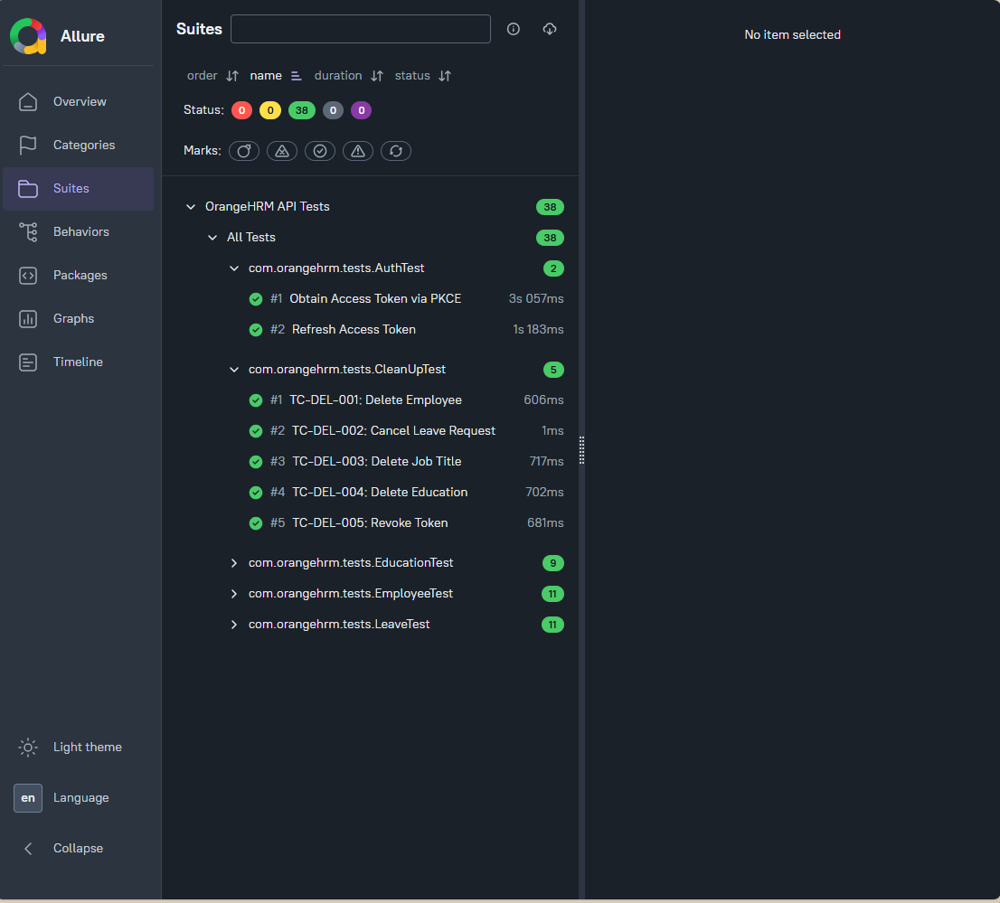
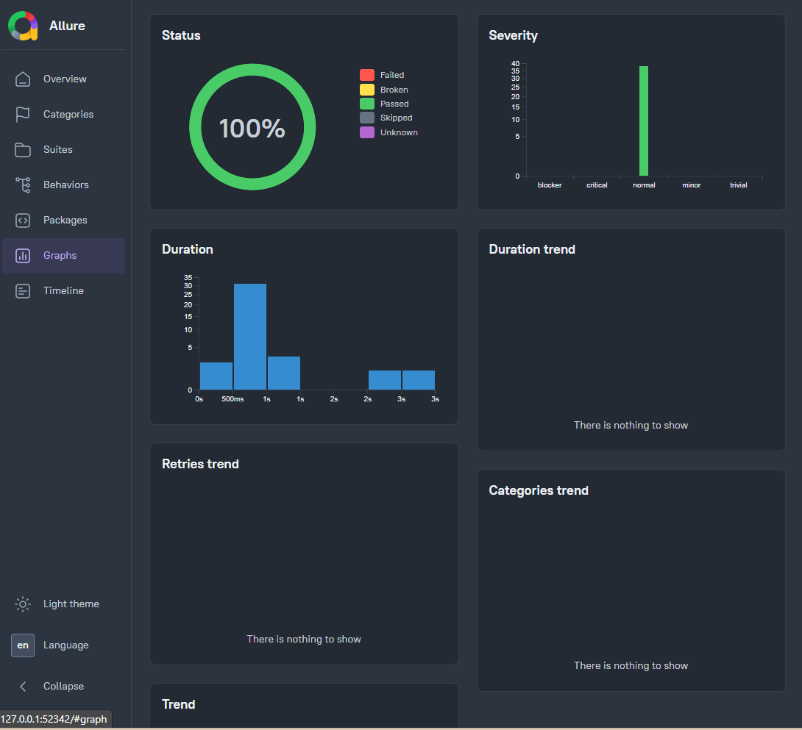

# OrangeHRM API Automation Framework

## 📌 Overview

This project is an API Automation Testing Framework developed for OrangeHRM REST APIs using Java, Rest Assured, TestNG, and Allure Report.

The framework automates authentication, employee management, education management, and leave management workflows while validating API functionality through positive and negative test scenarios.

The framework follows a reusable architecture with centralized configuration management, token handling, request specifications, and automated cleanup operations.

---

## 🚀 Technologies Used

* Java
* Rest Assured
* TestNG
* Maven
* Allure Report
* OAuth2 PKCE Authentication
* Git & GitHub

---

## 🏗 Framework Architecture

### BaseTest

Responsible for:

* Base URI configuration
* Common request specification
* Default headers
* Authenticated request specification

### ConfigManager

Responsible for:

* Reading environment configuration
* Managing API credentials
* Managing application settings

### TokenManager

Responsible for:

* Access token management
* Refresh token management
* Automatic token refresh
* Token lifecycle handling

---

## 📂 Project Structure

```text
src
├── test
│   ├── java
│   │   └── com.orangehrm
│   │       ├── base
│   │       │   └── BaseTest
│   │       │
│   │       ├── config
│   │       │   └── ConfigManager
│   │       │
│   │       ├── utils
│   │       │   └── TokenManager
│   │       │
│   │       └── tests
│   │           ├── AuthTest
│   │           ├── EmployeeTest
│   │           ├── EducationTest
│   │           ├── LeaveTest
│   │           └── CleanUpTest
│
├── allure-results
├── pom.xml
└── README.md
```

---

## 🔐 Authentication Module

### Positive Scenarios

* Obtain Access Token
* Obtain Refresh Token
* Refresh Access Token

### Validations

* Access Token is generated successfully
* Refresh Token is generated successfully
* Token refresh process succeeds

---

## 👨‍💼 Employee Module

### Positive Scenarios

* Create Employee
* Get Employee By ID
* Get Personal Details
* Update Personal Details
* Get Job Details
* Add Salary Component
* Get Employee Salary Components

### Negative Scenarios

* Create Employee without First Name
* Create Employee without Authentication Token
* Get Employee using Invalid ID
* Update Employee using Invalid Date

### Expected Status Codes

* 200 OK
* 401 Unauthorized
* 422 Unprocessable Entity

---

## 🎓 Education Module

### Positive Scenarios

* Create Education Record
* Get Education by ID
* Update Education Record
* List Education Records

### Negative Scenarios

* Missing Name
* Missing Authentication Token
* Invalid Education ID
* Update with Missing Name

### Expected Status Codes

* 200 OK
* 401 Unauthorized
* 404 Not Found
* 422 Unprocessable Entity

---

## 🏖 Leave Module

### Positive Scenarios

* Create Leave Type
* Get Leave Type by ID
* Update Leave Type
* Assign Leave Entitlement
* Configure Work Week
* Get Leave Balance

### Negative Scenarios

* Missing Leave Type Name
* Missing Authentication Token
* Invalid Leave Type ID
* Invalid Employee Number
* Approve Leave using Invalid Request ID

### Expected Status Codes

* 200 OK
* 401 Unauthorized
* 404 Not Found
* 422 Unprocessable Entity

---

## 🧹 Cleanup Module

To maintain a clean testing environment, cleanup operations are executed after test completion:

* Delete Employee
* Cancel Leave Request
* Delete Education Record
* Revoke Access Token

---

## ✅ Test Coverage

The framework includes:

* Positive Testing
* Negative Testing
* Authentication Testing
* CRUD API Testing
* Validation Testing
* Authorization Testing
* End-to-End Workflow Testing

---

## 🔄 Test Execution Flow

1. Generate Access Token
2. Refresh Access Token
3. Create Employee
4. Execute Employee Scenarios
5. Execute Education Scenarios
6. Execute Leave Scenarios
7. Perform Cleanup Operations
8. Revoke Access Token

---

## ⚙️ Prerequisites

Before running the project, ensure the following are installed:

* Java JDK 17+
* Maven
* Allure Commandline

---

## ▶️ Running Tests

Run all tests:

```bash
mvn clean test
```

Run TestNG Suite:

```bash
mvn test
```

---

## 📊 Allure Reporting

Generate Report:

```bash
allure generate allure-results --clean
```

Open Report:

```bash
allure open allure-report
```

Or directly:

```bash
allure serve allure-results
```

---

## 🎯 Key Features

* OAuth2 Authorization Code Flow with PKCE
* Reusable Request Specifications
* Automated Token Management
* Modular Framework Design
* Positive and Negative Testing
* Dynamic Test Data Handling
* Automated Cleanup
* Detailed Allure Reporting

---

## 👨‍💻 Author

Kerollos Raafat

Software Testing Engineer

### Skills

* Manual Testing
* API Testing
* Automation Testing
* Rest Assured
* TestNG
* Java
* Postman
* SQL
* Git & GitHub
* Allure Report

---

## 📸 Allure Report Screenshots

### Dashboard


### Overview


### Suites


### Graph
ph](screenshots/Graph.png)